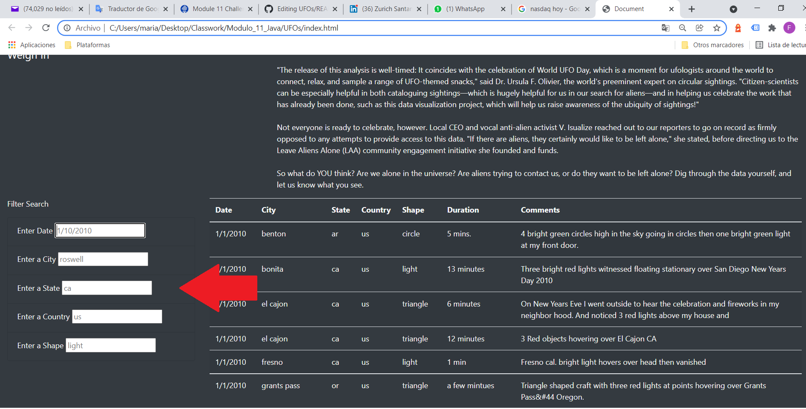
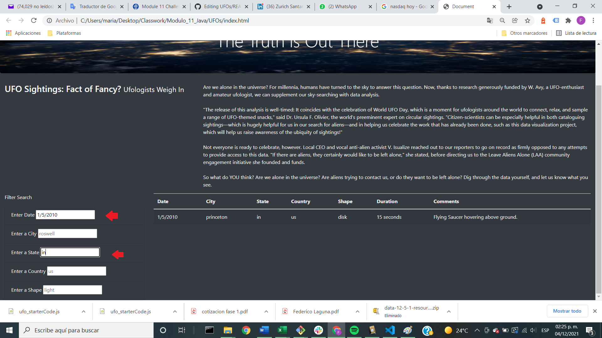

# UFOs

## Overview of the project
Dana’d like to provide a more in-depth analysis of UFO sightings by allowing users to filter for multiple criteria at the same time. In addition to the date, it will be possibe add table filters for the city, state, country, and shape.

## Results / Instructions:

1. Open the index.html

2. In the webepage that is opened, change the filters and you will get the information filtered in the table on the right side of the filter

## Summary:

The main drawback of this filters is that it is necessary to write the input as it is written in the table exactly, otherwise we won´t get the information we need.

Recommndations:

- Create a dropdown filter
- Include a word predictor to make it easier to find the word in the filter. 
